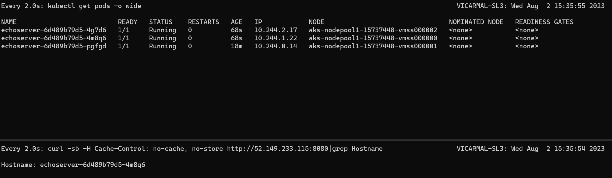
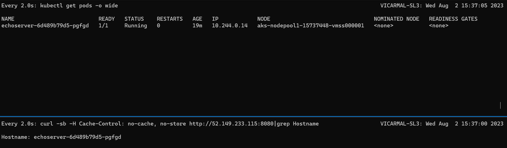
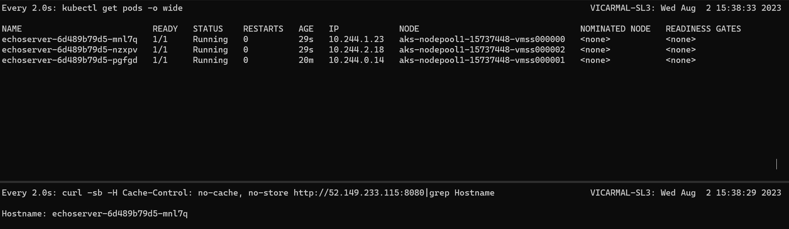

# AKS Sticky SLB Test - sessionAffinity=ClientIP, externalTrafficPolicy=Local

> Updated results with sessionAffinity=ClientIP and externalTrafficPolicy=Local. See [the original sample](https://github.com/swgriffith/azure-guides/tree/master/aks-sticky-slb) for additional details.

## Initial Deployment

Initially, we're connected to pod echoserver-6d489b79d5-4m8q6 on node 0:

## Scale Tests

Scaling down to 1 replica resulted in transitioning to a new pod since the original we were connected to was terminated. This is expected behavior. We're now connected to pod echoserver-6d489b79d5-pgfgd on node 1.

Scaling back up to 3 replicas results in the client then connecting to pod echoserver-6d489b79d5-mnl7q on node 0. This is unexpected/undesired. Ideally, the client session would remain on pod echoserver-6d489b79d5-pgfgd on node 1.

